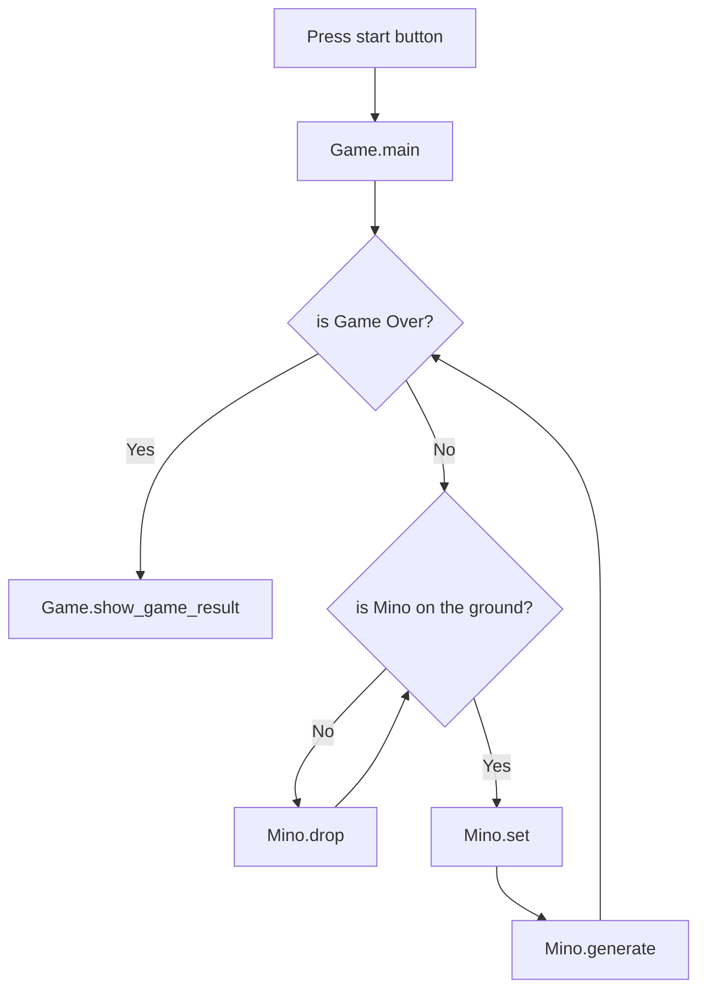

# wasm tetris architectures

## Flowchart

### 1. Game start

ver.2022.06.22
とりあえずゲーム開始 -> ミノ生成 -> 落下処理・接地判定・ゲームオーバー判定の実装

```mermaid
flowchart TD;
  A[Press start button] --> B[Game.main]
  B[Game.main] -->C{is Game Over?}
  C --> |Yes| D[Game.show_game_result]
  C --> |No| E{is Mino on the ground?}
  E --> |No| H[Mino.drop] --> E
  E --> |Yes| F[Mino.set] --> G[Mino.generate] --> C


```

## Models
